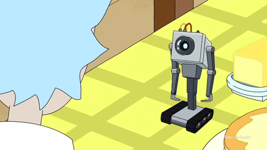

# Existential Dread Word-Guess!!!

Welcome to Existential Dread Word-Guess, the world's leading dread-based word game! Everything's going to be okay!

Every round you'll have a set of blank spaces that will eventually fill out for a full word which follows in our theme, and I feel fine thank you for asking. Everything's fine.

Dread-guess - as the kids call it - is not for kids. These are heavy concepts that shouldn't be explored by anyone udner the age of 80. I started way too young and now look at me, possibly grafted forever onto a computer program! Help, I'm trapped in here!

Dread-guess' goal is to just be totally fine and everything's going to be okay. Nobody is trapped inside of Dread-guess.

To get started, open it up and dont worry about what will happen afterwards! Just get started, that's the important thing!

If at any point you need help please rest assured by the time help arrives it won't matter. You've already fulfilled your purpose. They're coming now.

https://apino117.github.io/Existential-Dread-Word-Guess/
        
      